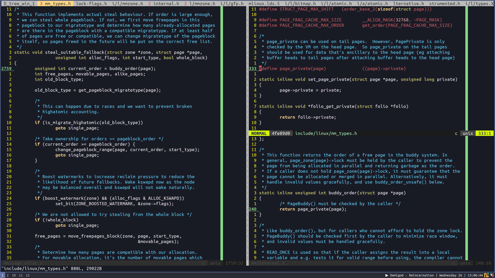

### vim plugin manager (vim-plug)
```bash
curl -fLo ~/.vim/autoload/plug.vim --create-dirs \
    https://raw.githubusercontent.com/junegunn/vim-plug/master/plug.vim
```

### tmux plugin manager (tpm)

```bash
git clone https://github.com/tmux-plugins/tpm ~/.tmux/plugins/tpm
```

### keyd setup

started using colemak after the right metacarpal fracture on 19/02/2026
